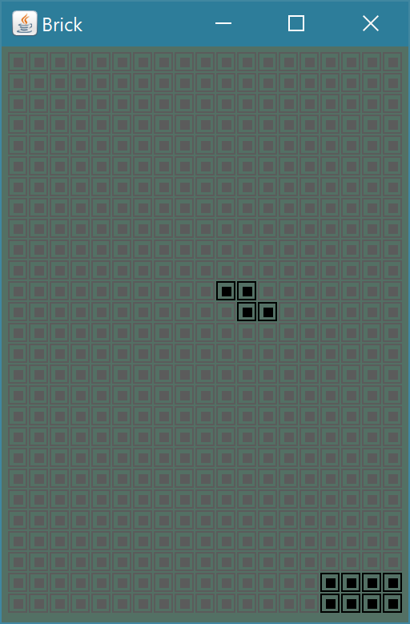

# Brick Game Emulator

### Warning: Very old, incomplete and probably noobish code.
#### Uploaded for archival purposes, though it does work.   

A brick game like emulator written "way-back-then" in Java. 
No textures being used, everything is drawn using Java AWT Library(java.awt.Graphics). 
Shapes and objects can be loaded from text files; See the [Alphabets](Alphabets) or [TetrisShapes](TetrisShapes) folders as examples to create new shapes.

